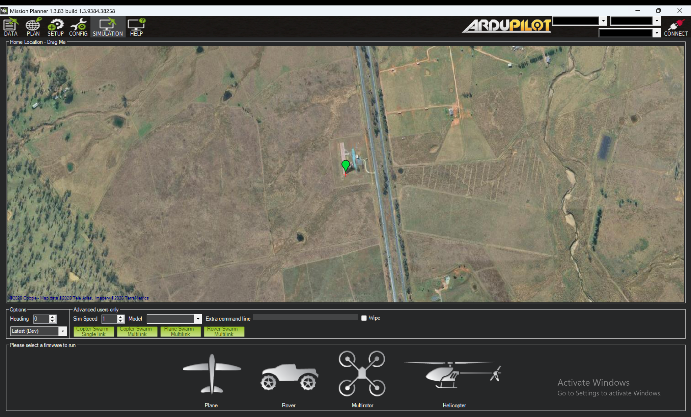
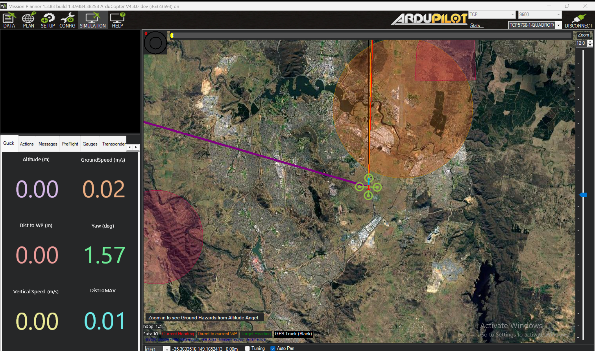
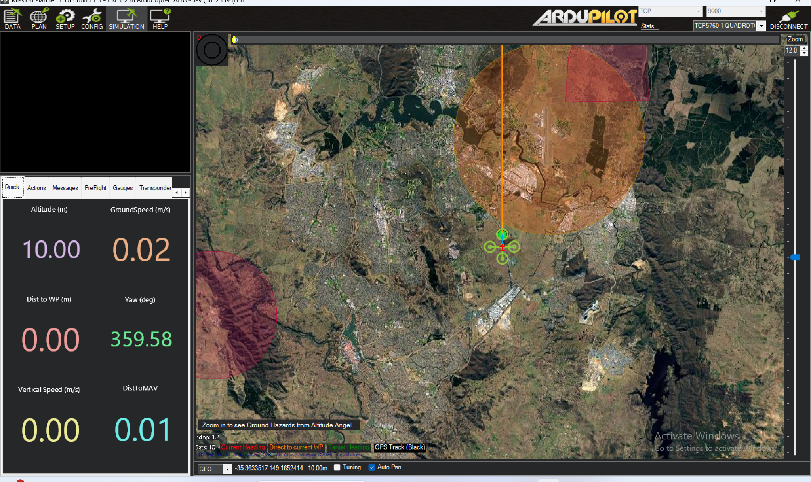
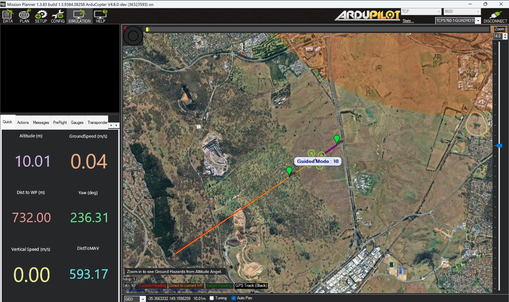

# Mission Planner Setup & SITL Simulation

This guide walks team members through installing Mission Planner and running a basic simulated flight (SITL), no hardware required.

## 1. Install Mission Planner

Download and install Mission Planner from the official ArduPilot site:

**https://ardupilot.org/planner/docs/mission-planner-installation.html**

> ⚠️ **Windows only.** Mission Planner does not run natively on macOS. If you're on a Mac, let a team lead know bc you'll need a Windows VM or an alternative workflow before continuing.

## 2. Start a Simulation

Open Mission Planner and navigate to the **Simulation** tab.

Click the **Multirotor** option for now (feel free to experiment with the others; Plane, Rover, Helicopter, once you're comfortable).

Once you select it, the simulation firmware will download automatically. When it's done, look for the **Actions** tab in the panel on the left.

## 3. Arm and Take Off

In the flight mode dropdown (labeled **Auto** by default), select **Guided**. Click the green **Arm/Disarm** button once.

Right-click anywhere on the map and select **Takeoff**. When prompted for an altitude, choose something over 5m - 10m works well for a first test. Feel free to experiment with higher/lower altitudes to get a feel for the sim's limits.

## 4. Fly to a Waypoint

Once your altitude reads correctly (e.g., 10m), right click a location on the map and select **Fly to Here**. Watch the drone fly there, you'll be prompted to set a speed (10 m/s is a reasonable default, but try other values too).

---

That's it, this is a good practice before we begin actually flying the drone. 
